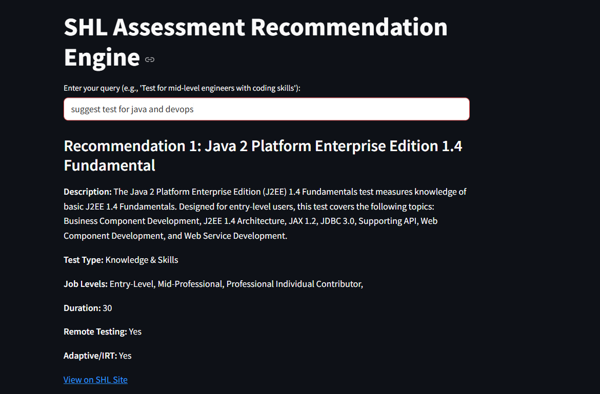
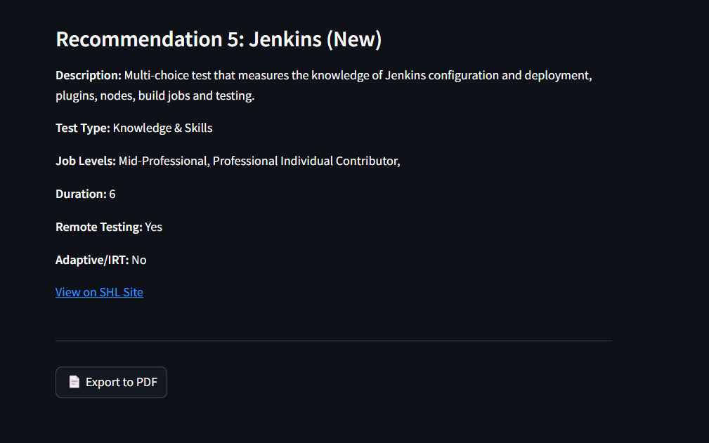

# SHL Recommendation Engine


A recommendation engine for SHL assessments that leverages FAISS, HuggingFace embeddings, and a custom LLM pipeline. The project includes a Streamlit-based user interface for querying recommendations and exporting results to PDF.


---

## Features
- **Recommendation Engine**: Provides tailored SHL assessment recommendations based on user input.
- **FAISS Indexing**: Efficient similarity search using FAISS.
- **HuggingFace Embeddings**: Semantic embeddings for document representation.
- **Custom LLM Pipeline**: Generates recommendations using a fine-tuned language model.
- **Streamlit App**: Interactive UI for querying and exporting recommendations.

---


## Installation

1. Clone the repository:
   ```bash
   git clone https://github.com/your-username/shl-recommendation-engine.git
   cd shl-recommendation-engine

 2. Install dependencies:

  pip install -r requirements.txt

3.  Set up the .env file:

  Add your HuggingFace API token in the .env file:
  HUGGINGFACEHUB_API_TOKEN=<YOUR_API_TOKEN>

4.   Download NLTK stopwords:

    python -c "import nltk; nltk.download('stopwords')"


 Usage
Start the Streamlit app:

streamlit run app.py
Enter your query in the input box (e.g., "Test for mid-level engineers with coding skills").

View recommendations and export them to a PDF if needed.

Project Structure
shl-recommendation-engine/

├── [app.py](http://_vscodecontentref_/0)                 # Streamlit app

├── [rag_engine.py](http://_vscodecontentref_/1)          # Recommendation engine logic

├── [utils.py](http://_vscodecontentref_/2)               # Utility functions for preprocessing and indexing

├── [shl_catalogue.json](http://_vscodecontentref_/3)     # SHL assessment data

├── [requirements.txt](http://_vscodecontentref_/4)       # Python dependencies

├── .env                   # Environment variables

└── README.md              # Project documentation

